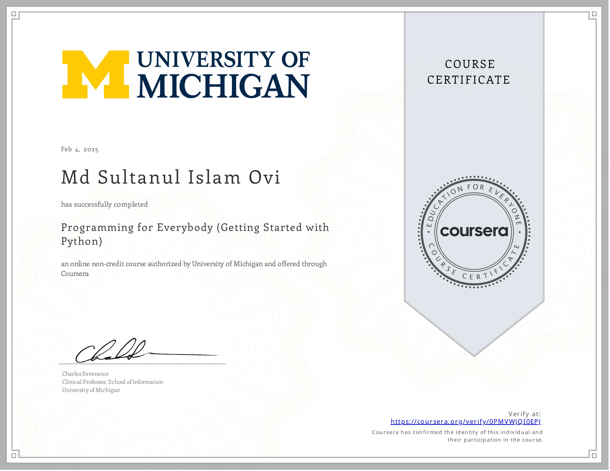

# 🐍 Python for Everybody Specialization

Welcome to my **Python for Everybody Specialization** repository! 🎉  
This journey builds upon the success of the **Python for Everybody** course and dives deep into fundamental programming concepts using Python. By the end of this specialization, I'll have mastered **data structures, networked application programming interfaces (APIs), and databases**, culminating in a **Capstone Project** where I'll design and develop my own applications for **data retrieval, processing, and visualization**. 🚀

Course Link: [Python for Everybody Specialization](https://www.coursera.org/specializations/python/){:target="_blank"}
---

## 📚 Courses in This Specialization

### 1️⃣ Programming for Everybody (Getting Started with Python) 🏁

This course lays the foundation for my Python journey. It covers the basics of programming with **zero prerequisites** and **minimal mathematics**. The goal? To help me build Python programs from scratch with **simple instructions**.

📖 **Textbook Chapters Covered:** 1-5

---

### 2️⃣ Python Data Structures 🔗

Time to level up! This course moves beyond basic procedural programming and explores Python’s **built-in data structures**—lists, dictionaries, and tuples—enabling me to **analyze and manipulate complex data** like a pro.

📖 **Textbook Chapters Covered:** 6-10

---

### 3️⃣ Using Python to Access Web Data 🌍

This course transforms the internet into my playground! I'll learn to **scrape, parse, and read web data**, using Python to interact with **HTML, XML, and JSON** formats. I’ll also work with **web APIs** to retrieve real-world data.

📖 **Textbook Chapters Covered:** 11-13

---

### 4️⃣ Using Databases with Python 🗄️

Here, I dive into **SQL, database design, and data storage** techniques. I'll use **SQLite3** to build databases and even create **web crawlers** to collect data. I'll also explore **D3.js** for **data visualization**.

📖 **Textbook Chapters Covered:** 14-15

---

### 5️⃣ Capstone: Retrieving, Processing, and Visualizing Data 📊

This is the ultimate test of everything I've learned! 💡 I'll build **real-world applications** for data retrieval, processing, and visualization. The first phase involves **guided visualizations**, and then I'll work on my **own project** to analyze data that I find interesting.

📖 **Textbook Chapters Covered:** 15-16

---

## 🎯 Why I’m Taking This Specialization

- ✅ To master **Python from the ground up**.
- ✅ To build **practical projects** with real-world data.
- ✅ To strengthen my knowledge of **APIs, databases, and data structures**.
- ✅ To prepare for more **advanced programming courses** and research projects.

---

📌 Stay tuned as I share my progress, projects, and insights from this specialization!
